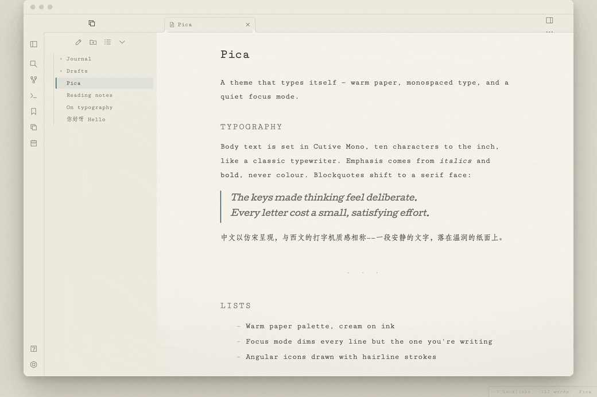
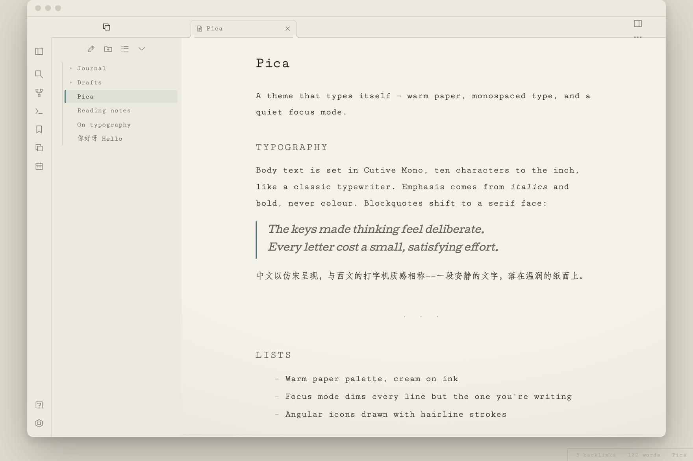
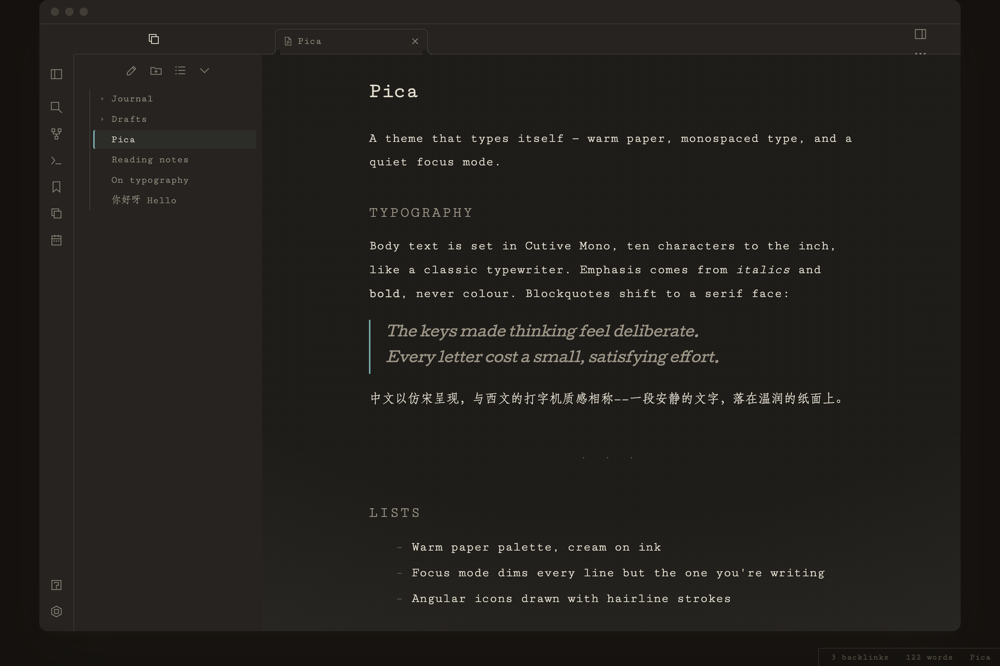

# Pica

A minimal, focused Obsidian theme built around a typewriter aesthetic — warm paper tones, monospaced type, square corners, and a quiet focus mode that dims everything but the line you're writing.

> Named after *pica*, the 10-characters-per-inch pitch of a classic typewriter.

  

## Features

- **Typewriter type.** Cutive Mono for body and interface, Cutive for serif accents (blockquotes). CJK text falls back to the system 仿宋 / Songti faces so Chinese reads like a typed document.
- **Warm paper palette.** Cream-on-ink in light mode, ink-on-charcoal in dark mode, with a teal accent. A faint vignette and paper grain give pages some atmosphere.
- **Focus mode.** In the editor, inactive lines dim so the current line stands out. Toggle it off in Style Settings if you'd rather see everything at full strength.
- **Angular icons.** The default round Lucide icons are repainted as thin, square-cornered glyphs (search, folders, files, the status circles, sidebar toggles, and more) to match the type, plus a global hairline stroke weight.
- **Considered typography.** Inline title, a ruled `h1`, letter-spaced uppercase `h2`, asterism (`· · ·`) horizontal rules, and en-dash list bullets.
- **Square edges.** Tight 2–3px corner radii throughout the UI.

## Install

### Manually

1. Download `theme.css` and `manifest.json` from this repository.
2. Put them in your vault under `.obsidian/themes/Pica/`.
3. In Obsidian, open **Settings → Appearance → Themes** and select **Pica**.

### Via BRAT

If you use the [BRAT](https://github.com/TfTHacker/obsidian42-brat) community plugin, add the beta theme `TKONIY/obsidian-pica`.

## Customization

Pica ships with a [Style Settings](https://github.com/mgmeyers/obsidian-style-settings) block. Install the **Style Settings** community plugin to adjust:

- **Accent color** (separate values for light and dark).
- **Readable line width** — the editor measure, in pixels.
- **Focus mode** — turn the inactive-line dimming on or off.

## Fonts

The Latin fonts (Cutive, Cutive Mono) load from Google Fonts via an `@import` at the top of `theme.css`, so the first load needs an internet connection on desktop. CJK glyphs use whatever 仿宋 / Songti face your system provides. To bundle the fonts offline, download the WOFF2 files and replace the `@import` with local `@font-face` rules.

## Screenshots

| Light — fine writing paper | Dark — night manuscript |
| :---: | :---: |
|  |  |

## License

[MIT](LICENSE) © TKONIY

---

Crafted with [Claude Code](https://claude.com/claude-code).
